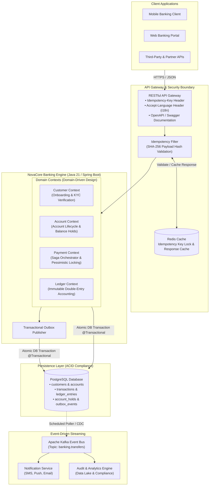

# NovaCore Banking Engine

NovaCore is an enterprise-grade core banking engine and real-time payment processing platform built with Java 21, Spring Boot, PostgreSQL, and Apache Kafka. 

The system implements strict **double-entry bookkeeping**, **deadlock-free concurrency controls**, **header-based idempotency**, and the **Transactional Outbox Pattern** to guarantee mathematical accuracy, auditability, and zero financial data loss.

---

## Architectural Principles & Core Capabilities

- **Mathematical Balance Invariance:** Implements formal double-entry accounting. Account balances are mathematically derived from paired debit and credit entries (`Sum(Debits) == Sum(Credits)`).
- **Append-Only Ledger Immutability:** Financial ledger entries are strictly immutable. No application service or administrative role possesses update or delete privileges on historical records.
- **Deadlock-Free Pessimistic Locking:** Eliminates race conditions and two-way deadlocks during concurrent fund transfers by sorting account identifiers prior to acquiring row-level locks (`SELECT ... FOR UPDATE`).
- **Guaranteed API Idempotency:** Financial mutation endpoints enforce `Idempotency-Key` headers, combining SHA-256 payload verification with cached response replay semantics.
- **Transactional Outbox & At-Least-Once Delivery:** Decouples domain event publishing to Apache Kafka within the same database transaction boundary as the financial settlement, eliminating dual-write failure modes.
- **High-Throughput Concurrency:** Leverages Java 21 Virtual Threads (Project Loom) to handle high-volume blocking I/O without the operational complexity of reactive frameworks.

---

## System Architecture



---

## Technology Stack

| Layer | Component | Version / Specification |
|---|---|---|
| **Runtime** | OpenJDK | 21 LTS (Virtual Threads enabled) |
| **Framework** | Spring Boot | 4.x / 3.x (WebMvc, Data JPA, Validation, Actuator) |
| **Database** | PostgreSQL | 16 (Alpine containerized) |
| **Migrations** | Flyway | Baseline migrations (`db/migration`) |
| **Event Bus** | Apache Kafka | Event streaming for settlement notifications |
| **Build Tool** | Gradle | Gradle Wrapper 9.x |
| **Testing** | JUnit 5 & Testcontainers | Multi-threaded concurrency verification |

---

## Project Structure

The project follows **Domain-Driven Design (DDD)** packaging to preserve clean architectural boundaries:

```
novacore-banking/
├── docker-compose.yml              # Local infrastructure (PostgreSQL 16, Adminer)
├── build.gradle                    # Build configuration and dependency declarations
├── docs/                           # Architecture specifications and execution roadmap
│   ├── PRD.md                      # Product requirements document
│   ├── TECHNICAL_DESIGN.md         # System design, DDL schema, and workflows
│   └── plan.md                     # Milestone development plan
└── src/
    ├── main/
    │   ├── java/com/novacore/banking/
    │   │   ├── NovacoreBankingApplication.java
    │   │   ├── account/            # Account & customer lifecycle bounded context
    │   │   ├── ledger/             # Double-entry ledger bounded context (append-only)
    │   │   ├── payment/            # Transfer orchestration and concurrency control
    │   │   └── shared/             # Outbox publisher, idempotency, global exception handlers
    │   └── resources/
    │       ├── application.yml     # Application configuration
    │       └── db/migration/       # Flyway SQL migration scripts (V1__init_schema.sql)
    └── test/                       # Concurrency, idempotency, and integration suites
```

---

## Getting Started

### Prerequisites
- **Java Development Kit (JDK):** 21 LTS or newer
- **Docker & Docker Compose:** Container runtime for local dependencies

### 1. Clone the Repository
```bash
git clone git@github.com:lovanbang999/novacore-banking.git
cd novacore-banking
```

### 2. Start Local Database Infrastructure
Spin up PostgreSQL 16 and Adminer via Docker Compose:
```bash
docker compose up -d
```

- PostgreSQL runs on `localhost:5432` (`database: novacore_db`, `username: novacore_user`).
- Adminer database management UI is available at `http://localhost:8081`.

### 3. Run the Application
Start the Spring Boot application using the Gradle wrapper:
```bash
./gradlew bootRun
```

Flyway will automatically execute pending migrations on startup. Verify the health status:
```bash
curl http://localhost:8080/actuator/health
```

Expected response:
```json
{"status":"UP"}
```

---

## API Specification Summary

### Initiate P2P Fund Transfer
- **Endpoint:** `POST /api/v1/transfers`
- **Header:** `Idempotency-Key: <UUID>` (Required)
- **Request Body:**
  ```json
  {
    "sourceAccountNumber": "ACC-100200300",
    "destinationAccountNumber": "ACC-900800700",
    "amount": 500000.0000,
    "currency": "VND",
    "description": "Monthly office rent"
  }
  ```
- **Response (201 Created):**
  ```json
  {
    "referenceNumber": "TXN-20260910-882341",
    "status": "SETTLED",
    "amount": 500000.0000,
    "currency": "VND",
    "sourceAccountNumber": "ACC-100200300",
    "destinationAccountNumber": "ACC-900800700",
    "createdAt": "2026-09-10T10:30:00.120Z"
  }
  ```

### Query Account Statement
- **Endpoint:** `GET /api/v1/accounts/{accountNumber}/statement?from=2026-09-01&to=2026-09-30&page=0&size=20`
- **Response (200 OK):**
  Returns chronological statement entries with running balance calculations for customer reconciliation.

---

## Documentation Links

Comprehensive engineering documentation is maintained in the `docs/` directory:
- [Product Requirements Document (PRD)](docs/PRD.md)
- [Technical Design Document](docs/TECHNICAL_DESIGN.md)
- [Milestone Execution Plan](docs/plan.md)

---

## License

This project is licensed under the Apache 2.0 License.
