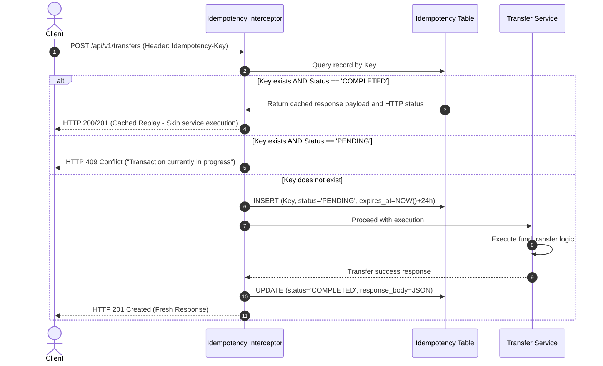

# Technical Design Document: NovaCore Banking Engine
**Subtitle:** Double-Entry Ledger Schema, Concurrency Controls, and Event-Driven Architecture  
**Target Stack:** Java 21 LTS · Spring Boot 4.x / 3.x · PostgreSQL 16 · Apache Kafka · Redis · Docker  
**Status:** Approved for Implementation  

---

## 1. System Architecture Overview

NovaCore adopts a **Modular Monolith architecture aligned with Domain-Driven Design (DDD)** principles. This design minimizes operational overhead during early phases while enforcing strict boundaries between Bounded Contexts, ensuring a frictionless transition to distributed microservices as scale dictates.

### 1.1 Architecture Diagram

```
                 +-------------------------------------------------+
                 |                Client Applications              |
                 |      (Mobile Banking / Web Portal / Partners)   |
                 +-------------------------------------------------+
                                           |
                                     HTTPS / JSON
                         (Header: Idempotency-Key: <UUID>)
                                           v
+---------------------------------------------------------------------------------+
|                                NovaCore Engine                                  |
|                                                                                 |
|  [Idempotency Filter / Interceptor] <---> [Redis Cache / Postgres Table]        |
|                                                                                 |
|  +---------------------------------------------------------------------------+  |
|  |                     Domain Services (Spring Boot)                         |  |
|  |                                                                           |  |
|  |  +---------------------+   +---------------------+   +-----------------+  |  |
|  |  |   Account Context   |   |   Payment Context   |   |  Ledger Context |  |  |
|  |  |  (Status & Limits)  |   | (Orchestrator/Saga) |   | (Double-Entry)  |  |  |
|  |  +---------------------+   +---------------------+   +-----------------+  |  |
|  |                                                                           |  |
|  |             +-----------------------------------------------+             |  |
|  |             |      Transactional Outbox Service             |             |  |
|  |             +-----------------------------------------------+             |  |
|  |  +---------------------------------------------------------------------+  |  |
|  +---------------------------------------|-----------------------------------+  |
|                                          |                                      |
|                                          | Atomic DB Transaction (@Transactional)|
|                                          v                                      |
|  +---------------------------------------------------------------------------+  |
|  |                      PostgreSQL Database (ACID)                           |  |
|  |   [accounts]   [transactions]   [ledger_entries]   [outbox_events]         |  |
|  +---------------------------------------------------------------------------+  |
+---------------------------------------------------------------------------------+
                                           |
                                  Scheduled Poller / CDC
                                           v
                             +---------------------------+
                             |     Apache Kafka Bus      |
                             | Topic: banking.transfers  |
                             +---------------------------+
                                           |
                   +-----------------------+-----------------------+
                   v                                               v
     +---------------------------+                   +---------------------------+
     |   Notification Consumer   |                   |    Audit & Analytics      |
     |    (Email, Push, SMS)     |                   |       Data Lake           |
     +---------------------------+                   +---------------------------+
```

---

## 2. Domain-Driven Design & Bounded Contexts

The codebase enforces strict packaging by business domain rather than technical layers:

```
com.novacore.banking
├── account/                    # Account Bounded Context
│   ├── domain/                 # Entity: Account, Enums: AccountStatus, AccountType
│   ├── application/            # Use cases: CreateAccountUseCase, GetAccountBalanceUseCase
│   └── infrastructure/         # JpaAccountRepository, AccountController
│
├── payment/                    # Payment & Transfer Bounded Context
│   ├── domain/                 # Entity: Transaction, Enums: TransferStatus
│   ├── application/            # TransferService (Orchestrator)
│   └── infrastructure/         # TransferController, IdempotencyRepository
│
├── ledger/                     # Core Accounting Bounded Context (Append-Only)
│   ├── domain/                 # Entity: LedgerEntry, Enums: EntryType (DEBIT/CREDIT)
│   ├── application/            # PostDoubleEntryUseCase
│   └── infrastructure/         # JpaLedgerEntryRepository (Append-Only)
│
└── shared/                     # Shared Infrastructure & Cross-Cutting Concerns
    ├── outbox/                 # OutboxEntity, OutboxPublisher (Kafka)
    ├── exception/              # GlobalExceptionHandler, DomainException
    └── config/                 # KafkaConfig, RedisConfig, WebConfig
```

---

## 3. Database Schema (PostgreSQL DDL)

Normalized schema designed for relational integrity, double-entry bookkeeping, and immutability.

### 3.1 Customers & Accounts
```sql
-- Customer Identity
CREATE TABLE customers (
    id UUID PRIMARY KEY DEFAULT gen_random_uuid(),
    full_name VARCHAR(255) NOT NULL,
    email VARCHAR(255) UNIQUE NOT NULL,
    phone_number VARCHAR(50) UNIQUE NOT NULL,
    kyc_status VARCHAR(50) NOT NULL DEFAULT 'PENDING_KYC', -- PENDING_KYC, VERIFIED, REJECTED
    created_at TIMESTAMP WITH TIME ZONE DEFAULT CURRENT_TIMESTAMP,
    updated_at TIMESTAMP WITH TIME ZONE DEFAULT CURRENT_TIMESTAMP
);

-- Checking / Settlement Accounts
CREATE TABLE accounts (
    id UUID PRIMARY KEY DEFAULT gen_random_uuid(),
    customer_id UUID NOT NULL REFERENCES customers(id),
    account_number VARCHAR(30) UNIQUE NOT NULL,
    currency VARCHAR(3) NOT NULL DEFAULT 'VND',           -- ISO 4217 Currency Code
    status VARCHAR(30) NOT NULL DEFAULT 'ACTIVE',          -- ACTIVE, FROZEN, CLOSED
    current_balance NUMERIC(19, 4) NOT NULL DEFAULT 0.0000, -- Cached balance for query performance
    version BIGINT NOT NULL DEFAULT 0,                     -- Optimistic locking fallback
    created_at TIMESTAMP WITH TIME ZONE DEFAULT CURRENT_TIMESTAMP,
    updated_at TIMESTAMP WITH TIME ZONE DEFAULT CURRENT_TIMESTAMP
);

CREATE INDEX idx_accounts_customer ON accounts(customer_id);
```

### 3.2 Double-Entry Ledger
```sql
-- High-Level Transaction Orders
CREATE TABLE transactions (
    id UUID PRIMARY KEY DEFAULT gen_random_uuid(),
    reference_number VARCHAR(64) UNIQUE NOT NULL,         -- Generated business reference (e.g. TXN-20260910-882341)
    source_account_id UUID NOT NULL REFERENCES accounts(id),
    destination_account_id UUID NOT NULL REFERENCES accounts(id),
    amount NUMERIC(19, 4) NOT NULL CHECK (amount > 0),
    currency VARCHAR(3) NOT NULL,
    status VARCHAR(30) NOT NULL,                           -- INITIATED, SETTLED, FAILED
    failure_reason VARCHAR(255),
    created_at TIMESTAMP WITH TIME ZONE DEFAULT CURRENT_TIMESTAMP,
    completed_at TIMESTAMP WITH TIME ZONE
);

-- Immutable Ledger Entries (APPEND-ONLY: Strictly no UPDATE or DELETE)
CREATE TABLE ledger_entries (
    id UUID PRIMARY KEY DEFAULT gen_random_uuid(),
    transaction_id UUID NOT NULL REFERENCES transactions(id),
    account_id UUID NOT NULL REFERENCES accounts(id),
    entry_type VARCHAR(10) NOT NULL,                      -- 'DEBIT' or 'CREDIT'
    amount NUMERIC(19, 4) NOT NULL CHECK (amount > 0),
    running_balance NUMERIC(19, 4) NOT NULL,               -- Balance snapshot immediately post-entry
    description VARCHAR(255),
    created_at TIMESTAMP WITH TIME ZONE DEFAULT CURRENT_TIMESTAMP
);

CREATE INDEX idx_ledger_account_created ON ledger_entries(account_id, created_at DESC);
```

### 3.3 Idempotency Records
```sql
CREATE TABLE idempotency_records (
    key VARCHAR(255) PRIMARY KEY,                         -- Extracted from 'Idempotency-Key' Header
    request_hash VARCHAR(64) NOT NULL,                    -- SHA-256 hash of the canonical request body
    status VARCHAR(30) NOT NULL,                          -- PENDING, COMPLETED, FAILED
    response_body TEXT,                                   -- Serialized response payload
    http_status_code INT,
    created_at TIMESTAMP WITH TIME ZONE DEFAULT CURRENT_TIMESTAMP,
    expires_at TIMESTAMP WITH TIME ZONE NOT NULL
);
```

### 3.4 Transactional Outbox
```sql
CREATE TABLE outbox_events (
    id UUID PRIMARY KEY DEFAULT gen_random_uuid(),
    aggregate_type VARCHAR(100) NOT NULL,                 -- 'TRANSFER', 'ACCOUNT'
    aggregate_id VARCHAR(100) NOT NULL,                   -- Root entity identifier
    event_type VARCHAR(100) NOT NULL,                     -- e.g., 'TransferSettledEvent'
    payload JSONB NOT NULL,
    status VARCHAR(30) NOT NULL DEFAULT 'PENDING',        -- PENDING, PUBLISHED, FAILED
    retry_count INT DEFAULT 0,
    created_at TIMESTAMP WITH TIME ZONE DEFAULT CURRENT_TIMESTAMP,
    processed_at TIMESTAMP WITH TIME ZONE
);

CREATE INDEX idx_outbox_pending ON outbox_events(status, created_at) WHERE status = 'PENDING';
```

---

## 4. Engineering Workflows

### 4.1 Idempotency Interceptor Sequence



---

### 4.2 Concurrency Control & Double-Entry Settlement

To eliminate **race conditions** (e.g., an account holding 100,000 VND attempting simultaneous 100,000 VND transfers from two separate channels) and **deadlocks**:

1. **Transaction Boundary:** Execute inside `@Transactional(isolation = Isolation.READ_COMMITTED)`.
2. **Deterministic Locking Order:** Sort account IDs before acquiring pessimistic locks. This eliminates deadlocks when Account A transfers to Account B concurrently with Account B transferring to Account A.
   ```sql
   -- Always acquire locks ordered by ascending UUID
   SELECT * FROM accounts WHERE id IN (:accA, :accB) ORDER BY id ASC FOR UPDATE;
   ```
3. **State & Balance Validation:**
   - Verify `sourceAccount.status == ACTIVE`.
   - Verify `sourceAccount.current_balance >= transferAmount`.
4. **Balance Adjustment:**
   - Decrement `sourceAccount.current_balance`.
   - Increment `destinationAccount.current_balance`.
5. **Persist Transaction Order:** Insert into `transactions` with `status = 'SETTLED'`.
6. **Double-Entry Booking (Two Paired Rows):**
   - Row 1: `account_id = source_id`, `entry_type = 'DEBIT'`, `amount = X`, `running_balance = source_new_balance`.
   - Row 2: `account_id = dest_id`, `entry_type = 'CREDIT'`, `amount = X`, `running_balance = dest_new_balance`.
7. **Enqueue Outbox Event:** Insert `TransferSettledEvent` into `outbox_events`.
8. **Commit:** Commit transaction. Steps 2 through 7 complete atomically or roll back completely.

---

### 4.3 Transactional Outbox Pattern & Kafka Publishing

**Problem Statement:** Directly invoking `kafkaTemplate.send()` inside a database transaction risks two failure modes:
- Database commits, but Kafka connection times out: Domain event is permanently lost.
- Kafka publish succeeds, but database transaction rolls back: Downstream consumers receive false events for transfers that never occurred.

**Solution:**
1. Events are written to the `outbox_events` table **within the exact same database transaction** as the financial transfer.
2. An asynchronous background scheduler polls for `status = 'PENDING'` records:
   - Publishes the event to Kafka topic `banking.transfers`.
   - Updates the outbox record to `status = 'PUBLISHED'` only upon receiving an explicit broker acknowledgment (ACK).
   - Guarantees **At-Least-Once Delivery** resilience even during broker outages.

---

## 5. REST API Specification

### 5.1 Initiate Fund Transfer
- **Method:** `POST`
- **Path:** `/api/v1/transfers`
- **Headers:**
  - `Content-Type: application/json`
  - `Idempotency-Key: c9a3e2b1-5f6e-4e58-bc33-0f0e8f7c9e10` (Required)
- **Request Body:**
  ```json
  {
    "sourceAccountNumber": "ACC-100200300",
    "destinationAccountNumber": "ACC-900800700",
    "amount": 500000.0000,
    "currency": "VND",
    "description": "Monthly rent payment"
  }
  ```
- **Response (`201 Created`):**
  ```json
  {
    "referenceNumber": "TXN-20260910-882341",
    "status": "SETTLED",
    "amount": 500000.0000,
    "currency": "VND",
    "sourceAccountNumber": "ACC-100200300",
    "destinationAccountNumber": "ACC-900800700",
    "createdAt": "2026-09-10T10:30:00.120Z"
  }
  ```

### 5.2 Retrieve Account Statement
- **Method:** `GET`
- **Path:** `/api/v1/accounts/{accountNumber}/statement?from=2026-09-01&to=2026-09-30&page=0&size=20`
- **Response (`200 OK`):**
  ```json
  {
    "accountNumber": "ACC-100200300",
    "currentBalance": 12500000.0000,
    "currency": "VND",
    "entries": [
      {
        "id": "7b8e1f02-...",
        "transactionReference": "TXN-20260910-882341",
        "type": "DEBIT",
        "amount": 500000.0000,
        "runningBalance": 12500000.0000,
        "description": "Monthly rent payment",
        "timestamp": "2026-09-10T10:30:00.120Z"
      }
    ]
  }
  ```

---

## 6. Verification & Testing Strategy

To validate financial consistency, automated test suites must verify concurrency and idempotency invariants:

1. **Domain Unit Tests:** Pure business rules validation (disallow negative balances, reject operations on closed accounts).
2. **Multi-Threaded Concurrency Test (ExecutorService + CountDownLatch):**
   - Provision an account with `1,000,000 VND`.
   - Dispatch 10 parallel threads, each attempting a `200,000 VND` withdrawal simultaneously.
   - **Assertion:** Exactly 5 transactions succeed, exactly 5 fail with `InsufficientFundsException`. Final balance must equal `0 VND` (no negative balance or lost updates).
3. **Idempotency Resilience Test:**
   - Transmit 5 concurrent HTTP requests sharing the same `Idempotency-Key`.
   - **Assertion:** Exactly 1 transfer settles in the database; 4 requests receive the cached result. Total ledger entries created equals exactly 2.
