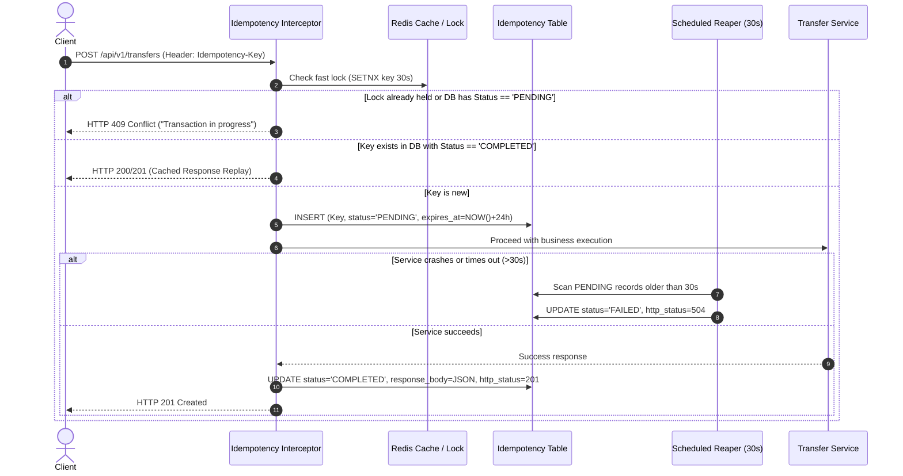
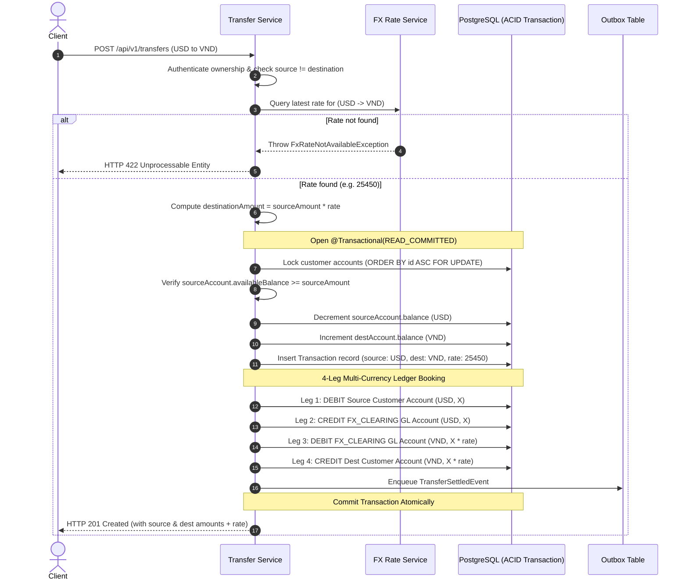

# Technical Design Document: NovaCore Banking Engine
**Subtitle:** Multi-Currency Ledger, FX Rate Engine, Concurrency Controls, and Event-Driven Architecture  
**Target Stack:** Java 21 LTS · Spring Boot 4.x / 3.x · PostgreSQL 16 · Redis 7 · Apache Kafka · Docker  
**Status:** Approved for Implementation (v1.2.0)  

---

## 1. System Architecture Overview

NovaCore adopts a **Modular Monolith architecture aligned with Domain-Driven Design (DDD)**. The system isolates business contexts while utilizing Redis for high-speed read caching and fast distributed locking, PostgreSQL for durable ACID transactions, and Apache Kafka for decoupled event delivery.

### 1.1 Architecture Diagram

```
                 +-------------------------------------------------+
                 |                Client Applications              |
                 |      (Mobile Banking / Web Portal / Partners)   |
                 +-------------------------------------------------+
                                           |
                                     HTTPS / JSON
                    (Headers: Authorization: Bearer <JWT>,
                              Idempotency-Key: <UUID>)
                                           v
+---------------------------------------------------------------------------------+
|                                NovaCore Engine                                  |
|                                                                                 |
|  [Security & JWT Filter] ------------> Resolves Principal (Customer vs Admin)  |
|                                                                                 |
|  [Idempotency Filter / Interceptor] <---> [Redis Fast Lock & Cache]             |
|                                           [PostgreSQL Idempotency Records]      |
|                                                                                 |
|  +---------------------------------------------------------------------------+  |
|  |                     Domain Services (Spring Boot)                         |  |
|  |                                                                           |  |
|  |  +---------------------+   +---------------------+   +-----------------+  |  |
|  |  |   Account Context   |   |   Payment Context   |   |  Ledger Context |  |  |
|  |  | (Lifecycle & Holds) |   | (Orchestrator/Saga) |   |  (Double-Entry  |  |  |
|  |  +---------------------+   +---------------------+   |   & GL Accounts)|  |  |
|  |                                       |              +-----------------+  |  |
|  |                                       v                                   |  |
|  |                            +---------------------+                        |  |
|  |                            |   FX Rate Service   |                        |  |
|  |                            | (Point-in-Time Seed)|                        |  |
|  |                            +---------------------+                        |  |
|  |                                                                           |  |
|  |  +-----------------------------+   +-----------------------------------+  |  |
|  |  | Idempotency Reaper Service  |   |   Transactional Outbox Service    |  |  |
|  |  | (Cleans timed-out PENDING)  |   |   (At-Least-Once Publisher)       |  |  |
|  |  +-----------------------------+   +-----------------------------------+  |  |
|  +---------------------------------------|-----------------------------------+  |
|                                          |                                      |
|                                          | Atomic DB Transaction (@Transactional)|
|                                          v                                      |
|  +---------------------------------------------------------------------------+  |
|  |                      PostgreSQL Database (ACID)                           |  |
|  |   [customers]       [gl_accounts]       [accounts]         [account_holds] |  |
|  |   [fx_rates]        [transactions]      [ledger_entries]   [outbox_events] |  |
|  +---------------------------------------------------------------------------+  |
+---------------------------------------------------------------------------------+
                                           |
                                  Scheduled Poller / CDC
                                           v
                             +---------------------------+
                             |     Apache Kafka Bus      |
                             | Topic: banking.transfers  |
                             +---------------------------+
                                           |
                   +-----------------------+-----------------------+
                   v                                               v
     +---------------------------+                   +---------------------------+
     |   Notification Consumer   |                   |    Audit & Analytics      |
     |    (Email, Push, SMS)     |                   |       Data Lake           |
     +---------------------------+                   +---------------------------+
```

---

## 2. Domain-Driven Design & Bounded Contexts

The project strictly organizes packages by business domain:

```
com.novacore.banking
├── account/                    # Account Bounded Context
│   ├── domain/                 # Entities: Customer, Account, AccountHold
│   │                           # Enums: AccountStatus, AccountType, HoldStatus, KycStatus
│   ├── application/            # Use cases: CreateAccountUseCase, GetAccountBalanceUseCase,
│   │                           # Backoffice: ActivateAccountUseCase, FreezeAccountUseCase, CloseAccountUseCase
│   └── infrastructure/         # JpaAccountRepository, JpaHoldRepository, AccountController, BackofficeAccountController
│
├── payment/                    # Payment & Transfer Bounded Context
│   ├── domain/                 # Entity: Transaction, Enums: TransferStatus
│   │                           # Exceptions: FxRateNotAvailableException, SelfTransferException, InsufficientFundsException
│   ├── application/            # TransferService (Pessimistic Locking & 2-Leg / 4-Leg Routing)
│   └── infrastructure/         # TransferController, JpaTransactionRepository
│
├── fx/                         # Foreign Exchange Bounded Context
│   ├── domain/                 # Entity: FxRate (BaseCurrency, QuoteCurrency, Rate, EffectiveAt)
│   ├── application/            # FxRateService (Point-in-time rate lookup & conversion calculation)
│   └── infrastructure/         # FxRateController, JpaFxRateRepository
│
├── ledger/                     # Core Accounting Bounded Context (Append-Only)
│   ├── domain/                 # Entities: LedgerEntry, GlAccount
│   │                           # Enums: EntryType (DEBIT/CREDIT), AccountRefType (CUSTOMER/GL)
│   ├── application/            # PostDoubleEntryUseCase, LedgerReconciliationService
│   └── infrastructure/         # JpaLedgerEntryRepository, JpaGlAccountRepository
│
└── shared/                     # Shared Kernel & Cross-Cutting Infrastructure
    ├── security/               # JwtAuthenticationFilter, JwtTokenProvider, SecurityConfig, UserPrincipal
    ├── idempotency/            # IdempotencyFilter, IdempotencyReaperJob, JpaIdempotencyRepository
    ├── outbox/                 # OutboxEvent, OutboxPublisher
    └── exception/              # GlobalExceptionHandler, DomainException
```

---

## 3. Database Schema (PostgreSQL DDL)

Normalized schema enforcing relational integrity, double-entry bookkeeping, balance holds, foreign exchange auditability, and immutability.

### 3.1 Customers, GL Accounts & Accounts
```sql
-- Customer Identity & KYC
CREATE TABLE customers (
    id UUID PRIMARY KEY DEFAULT gen_random_uuid(),
    full_name VARCHAR(255) NOT NULL,
    email VARCHAR(255) UNIQUE NOT NULL,
    phone_number VARCHAR(50) UNIQUE NOT NULL,
    kyc_status VARCHAR(50) NOT NULL DEFAULT 'PENDING_KYC', -- PENDING_KYC, VERIFIED, REJECTED
    created_at TIMESTAMP WITH TIME ZONE DEFAULT CURRENT_TIMESTAMP,
    updated_at TIMESTAMP WITH TIME ZONE DEFAULT CURRENT_TIMESTAMP
);

-- Chart of Accounts (Bank Internal General Ledger)
CREATE TABLE gl_accounts (
    id UUID PRIMARY KEY DEFAULT gen_random_uuid(),
    code VARCHAR(20) UNIQUE NOT NULL,                      -- e.g., 'FX_CLEARING', 'FEE_INCOME', 'VAULT'
    account_type VARCHAR(20) NOT NULL,                     -- ASSET, LIABILITY, INCOME, EXPENSE
    name VARCHAR(255) NOT NULL,
    created_at TIMESTAMP WITH TIME ZONE DEFAULT CURRENT_TIMESTAMP
);

-- Baseline GL System Accounts
INSERT INTO gl_accounts (id, code, account_type, name) VALUES 
('00000000-0000-0000-0000-000000000001', 'FX_CLEARING', 'LIABILITY', 'Foreign Exchange Clearing Account'),
('00000000-0000-0000-0000-000000000002', 'FEE_INCOME', 'INCOME', 'Transaction Fee Income Account'),
('00000000-0000-0000-0000-000000000003', 'VAULT', 'ASSET', 'Central Cash Vault Account');

-- Customer Settlement / Checking Accounts
CREATE TABLE accounts (
    id UUID PRIMARY KEY DEFAULT gen_random_uuid(),
    customer_id UUID NOT NULL REFERENCES customers(id),
    account_number VARCHAR(30) UNIQUE NOT NULL,
    currency VARCHAR(3) NOT NULL DEFAULT 'VND',           -- ISO 4217 Currency Code
    status VARCHAR(30) NOT NULL DEFAULT 'PENDING_KYC',     -- PENDING_KYC, ACTIVE, FROZEN, CLOSED
    current_balance NUMERIC(19, 4) NOT NULL DEFAULT 0.0000, -- Booked ledger balance
    version BIGINT NOT NULL DEFAULT 0,                     -- Optimistic locking fallback
    created_at TIMESTAMP WITH TIME ZONE DEFAULT CURRENT_TIMESTAMP,
    updated_at TIMESTAMP WITH TIME ZONE DEFAULT CURRENT_TIMESTAMP
);

CREATE INDEX idx_accounts_customer ON accounts(customer_id);

-- Account Holds / Balance Reservations
CREATE TABLE account_holds (
    id UUID PRIMARY KEY DEFAULT gen_random_uuid(),
    account_id UUID NOT NULL REFERENCES accounts(id),
    amount NUMERIC(19, 4) NOT NULL CHECK (amount > 0),
    reason VARCHAR(255),
    status VARCHAR(20) NOT NULL DEFAULT 'ACTIVE',          -- ACTIVE, RELEASED, CAPTURED
    expires_at TIMESTAMP WITH TIME ZONE,
    created_at TIMESTAMP WITH TIME ZONE DEFAULT CURRENT_TIMESTAMP
);

CREATE INDEX idx_holds_account_status ON account_holds(account_id, status) WHERE status = 'ACTIVE';
```

### 3.2 Foreign Exchange Rates Table
```sql
CREATE TABLE fx_rates (
    id UUID PRIMARY KEY DEFAULT gen_random_uuid(),
    base_currency VARCHAR(3) NOT NULL,                     -- e.g. 'USD'
    quote_currency VARCHAR(3) NOT NULL,                    -- e.g. 'VND'
    rate NUMERIC(18, 8) NOT NULL CHECK (rate > 0),         -- 1 base_currency = rate * quote_currency
    source VARCHAR(50) NOT NULL DEFAULT 'MANUAL',          -- MANUAL, EXTERNAL_PROVIDER
    effective_at TIMESTAMP WITH TIME ZONE NOT NULL DEFAULT CURRENT_TIMESTAMP,
    created_at TIMESTAMP WITH TIME ZONE DEFAULT CURRENT_TIMESTAMP,
    UNIQUE (base_currency, quote_currency, effective_at)
);

CREATE INDEX idx_fx_rates_lookup ON fx_rates(base_currency, quote_currency, effective_at DESC);

-- Baseline Seed Rates
INSERT INTO fx_rates (base_currency, quote_currency, rate, source, effective_at) VALUES 
('USD', 'VND', 25450.00000000, 'MANUAL', CURRENT_TIMESTAMP),
('VND', 'USD', 0.00003929, 'MANUAL', CURRENT_TIMESTAMP),
('AUD', 'VND', 16800.00000000, 'MANUAL', CURRENT_TIMESTAMP),
('VND', 'AUD', 0.00005952, 'MANUAL', CURRENT_TIMESTAMP),
('USD', 'AUD', 1.51500000, 'MANUAL', CURRENT_TIMESTAMP),
('AUD', 'USD', 0.66000000, 'MANUAL', CURRENT_TIMESTAMP);
```

### 3.3 Transactions & Multi-Currency Double-Entry Ledger
```sql
-- Transaction Orders (Records both source and destination amounts/currencies)
CREATE TABLE transactions (
    id UUID PRIMARY KEY DEFAULT gen_random_uuid(),
    reference_number VARCHAR(64) UNIQUE NOT NULL,         -- e.g., TXN-20260911-882341
    source_account_id UUID NOT NULL REFERENCES accounts(id),
    destination_account_id UUID NOT NULL REFERENCES accounts(id),
    source_amount NUMERIC(19, 4) NOT NULL CHECK (source_amount > 0),
    source_currency VARCHAR(3) NOT NULL,
    destination_amount NUMERIC(19, 4) NOT NULL CHECK (destination_amount > 0),
    destination_currency VARCHAR(3) NOT NULL,
    fx_rate_applied NUMERIC(18, 8),                        -- NULL if same currency, rate if cross-currency
    status VARCHAR(30) NOT NULL,                           -- INITIATED, SETTLED, FAILED
    failure_reason VARCHAR(255),
    created_at TIMESTAMP WITH TIME ZONE DEFAULT CURRENT_TIMESTAMP,
    completed_at TIMESTAMP WITH TIME ZONE,
    CONSTRAINT chk_different_accounts CHECK (source_account_id != destination_account_id)
);

CREATE INDEX idx_transactions_status_created ON transactions(status, created_at);

-- Immutable Ledger Entries (Polymorphic & Multi-Currency per Leg)
CREATE TABLE ledger_entries (
    id UUID PRIMARY KEY DEFAULT gen_random_uuid(),
    transaction_id UUID NOT NULL REFERENCES transactions(id),
    account_id UUID NOT NULL,                              -- References accounts(id) or gl_accounts(id)
    account_ref_type VARCHAR(10) NOT NULL DEFAULT 'CUSTOMER', -- 'CUSTOMER' or 'GL'
    entry_type VARCHAR(10) NOT NULL,                      -- 'DEBIT' or 'CREDIT'
    amount NUMERIC(19, 4) NOT NULL CHECK (amount > 0),
    currency VARCHAR(3) NOT NULL,                         -- Currency of this leg
    running_balance NUMERIC(19, 4) NOT NULL,               -- Balance snapshot immediately post-entry
    fx_rate_applied NUMERIC(18, 8),                       -- Populated on cross-currency clearing legs
    base_currency_equivalent NUMERIC(19, 4),               -- Normalized equivalent for audit
    description VARCHAR(255),
    created_at TIMESTAMP WITH TIME ZONE DEFAULT CURRENT_TIMESTAMP
);

CREATE INDEX idx_ledger_account_created ON ledger_entries(account_ref_type, account_id, created_at DESC);
CREATE INDEX idx_ledger_currency ON ledger_entries(currency);
```

### 3.4 Idempotency & Outbox Events
```sql
CREATE TABLE idempotency_records (
    key VARCHAR(255) PRIMARY KEY,                         -- Extracted from 'Idempotency-Key' Header
    request_hash VARCHAR(64) NOT NULL,                    -- SHA-256 hash of canonical request body
    status VARCHAR(30) NOT NULL,                          -- PENDING, COMPLETED, FAILED
    response_body TEXT,                                   -- Cached response JSON
    http_status_code INT,
    created_at TIMESTAMP WITH TIME ZONE DEFAULT CURRENT_TIMESTAMP,
    expires_at TIMESTAMP WITH TIME ZONE NOT NULL
);

CREATE INDEX idx_idempotency_pending ON idempotency_records(status, created_at) WHERE status = 'PENDING';

CREATE TABLE outbox_events (
    id UUID PRIMARY KEY DEFAULT gen_random_uuid(),
    aggregate_type VARCHAR(100) NOT NULL,                 -- 'TRANSFER', 'ACCOUNT'
    aggregate_id VARCHAR(100) NOT NULL,
    event_type VARCHAR(100) NOT NULL,
    payload JSONB NOT NULL,
    status VARCHAR(30) NOT NULL DEFAULT 'PENDING',        -- PENDING, PUBLISHED, FAILED
    retry_count INT DEFAULT 0,
    created_at TIMESTAMP WITH TIME ZONE DEFAULT CURRENT_TIMESTAMP,
    processed_at TIMESTAMP WITH TIME ZONE
);

CREATE INDEX idx_outbox_pending ON outbox_events(status, created_at) WHERE status = 'PENDING';
```

---

## 4. Engineering Workflows

### 4.1 Idempotency Interceptor & Reaper Workflow



---

### 4.2 Cross-Currency Settlement & 4-Leg Ledger Workflow



#### Why 4-Leg Postings?
In cross-currency transfers, comparing debits in USD directly against credits in VND is mathematically invalid ($100 \neq 2,545,000$). The 4-leg model introduces the `FX_CLEARING` account to maintain exact debit-credit equality within **each individual currency**:
- **In USD:** $\text{DEBIT(Customer)} = 100$, $\text{CREDIT(FX\_CLEARING)} = 100 \implies \text{Net USD} = 0$.
- **In VND:** $\text{DEBIT(FX\_CLEARING)} = 2,545,000$, $\text{CREDIT(Customer)} = 2,545,000 \implies \text{Net VND} = 0$.

#### GL Clearing Account Concurrency & Locking Strategy
In a high-throughput banking system, acquiring a pessimistic row lock (`SELECT ... FOR UPDATE`) on the shared `FX_CLEARING` GL account would serialize all cross-currency transfers in the bank, creating an unacceptable throughput bottleneck.

Because ledger entries are strictly **append-only** and GL account balances are derived asynchronously through reconciliation aggregates, **no pessimistic row lock is acquired on `gl_accounts`**. Only the customer source account and customer destination account acquire row-level locks (ordered deterministically by UUID). This guarantees high throughput while preserving mathematical accounting integrity.

---

### 4.3 Account State Machine & Backoffice Rules

```
                      +-------------------+
                      |   PENDING_KYC     | (Initial State)
                      +-------------------+
                                |
                   activate (KYC == VERIFIED)
                                v
+------------+       activate       +------------+
|   FROZEN   | <------------------> |   ACTIVE   |
+------------+        freeze        +------------+
      |                                   |
      | close (balance == 0)              | close (balance == 0)
      v                                   v
+------------------------------------------------+
|                    CLOSED                      | (Terminal State)
+------------------------------------------------+
```

- **Activation Rule:** Transition from `PENDING_KYC` to `ACTIVE` is strictly rejected unless `customer.kyc_status == 'VERIFIED'`.
- **Freeze Rule:** Blocks debits while allowing credits.
- **Close Rule:** Account must have zero balance (`currentBalance == 0.0000`) and zero active holds before closing.
- **Terminal Invariant:** Once in `CLOSED` state, accounts cannot transition to any other state.

---

## 5. REST API Specification

### 5.1 Initiate Fund Transfer (Same-Currency or Cross-Currency)
- **Method:** `POST /api/v1/transfers`
- **Headers:**
  - `Authorization: Bearer <JWT>`
  - `Idempotency-Key: <UUID>` (Required)
- **Request Body:**
  ```json
  {
    "sourceAccountNumber": "ACC-USD-100200",
    "destinationAccountNumber": "ACC-VND-900800",
    "amount": 100.0000,
    "currency": "USD",
    "description": "Cross-currency rent transfer"
  }
  ```
- **Response (`201 Created`):**
  ```json
  {
    "referenceNumber": "TXN-20260911-882341",
    "status": "SETTLED",
    "sourceAccountNumber": "ACC-USD-100200",
    "sourceAmount": 100.0000,
    "sourceCurrency": "USD",
    "destinationAccountNumber": "ACC-VND-900800",
    "destinationAmount": 2545000.0000,
    "destinationCurrency": "VND",
    "fxRateApplied": 25450.00000000,
    "createdAt": "2026-09-11T10:30:00.120Z"
  }
  ```

### 5.2 Query Exchange Rate
- **Method:** `GET /api/v1/fx-rates?base=USD&quote=VND`
- **Headers:** `Authorization: Bearer <JWT>`
- **Response (`200 OK`):**
  ```json
  {
    "baseCurrency": "USD",
    "quoteCurrency": "VND",
    "rate": 25450.00000000,
    "source": "MANUAL",
    "effectiveAt": "2026-09-11T00:00:00Z"
  }
  ```

### 5.3 Retrieve Account Balance & Holds
- **Method:** `GET /api/v1/accounts/{accountNumber}`
- **Headers:** `Authorization: Bearer <JWT>`
- **Response (`200 OK`):**
  ```json
  {
    "accountNumber": "ACC-USD-100200",
    "currency": "USD",
    "status": "ACTIVE",
    "currentBalance": 1000.0000,
    "availableBalance": 800.0000,
    "activeHoldsAmount": 200.0000,
    "createdAt": "2026-09-10T12:00:00Z"
  }
  ```

### 5.4 Backoffice Account Operations (Restricted to `ROLE_BACKOFFICE`)
- **Activate Account:** `PATCH /api/v1/accounts/{accountNumber}/activate` (HTTP 200)
- **Freeze Account:** `PATCH /api/v1/accounts/{accountNumber}/freeze` (HTTP 200)
- **Close Account:** `PATCH /api/v1/accounts/{accountNumber}/close` (HTTP 200)

---

## 6. Verification & Automated Reconciliation

1. **Continuous Per-Currency Ledger Reconciliation Job:**
   - Executes periodic verification checking that for every currency $c$, all debits and credits sum to zero:
     ```sql
     SELECT currency,
            SUM(CASE WHEN entry_type = 'DEBIT' THEN amount ELSE 0 END) AS total_debits,
            SUM(CASE WHEN entry_type = 'CREDIT' THEN amount ELSE 0 END) AS total_credits
     FROM ledger_entries
     GROUP BY currency
     HAVING SUM(CASE WHEN entry_type = 'DEBIT' THEN amount ELSE 0 END) != 
            SUM(CASE WHEN entry_type = 'CREDIT' THEN amount ELSE 0 END);
     ```
   - Any returned record indicates currency imbalance and throws a critical `LedgerDriftException`.
2. **Multi-Threaded Concurrency Test:**
   - 10 concurrent threads attempt `200,000 VND` withdrawals against a `1,000,000 VND` available balance.
   - Asserts exactly 5 successes, 5 failures, and final balance of `0.0000 VND`.
3. **Cross-Currency 4-Leg Unit Test:**
   - Initiates USD to VND transfer. Asserts exactly 4 ledger entries: 2 in USD, 2 in VND, with `FX_CLEARING` bridging the pair.
4. **FX Rate Failure & Rollback Test:**
   - Initiates transfer for currency pair without an active FX rate. Asserts `FxRateNotAvailableException`, HTTP 422, zero balance mutation, and zero ledger entries.
5. **Idempotency & Reaper Test:**
   - Concurrently posts identical request with same key. Verifies single debit.
   - Simulates hung transaction and verifies reaper transitions status from `PENDING` to `FAILED` after 30s.
